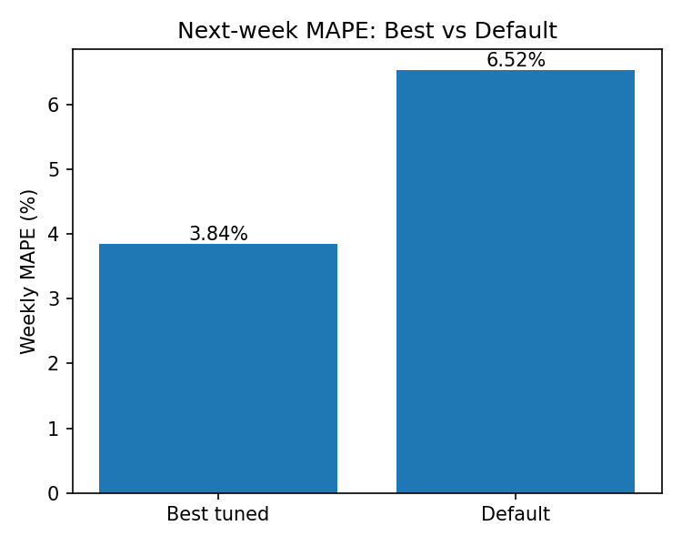
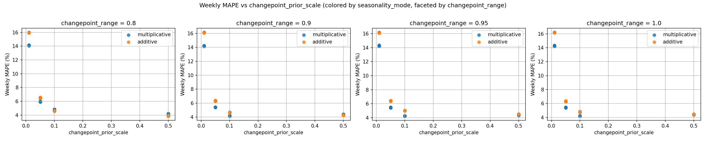
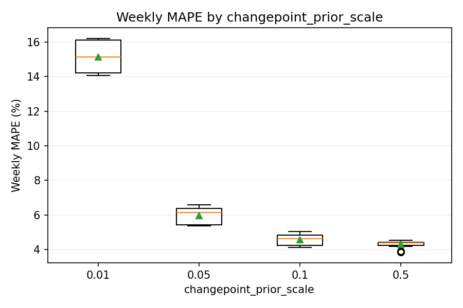
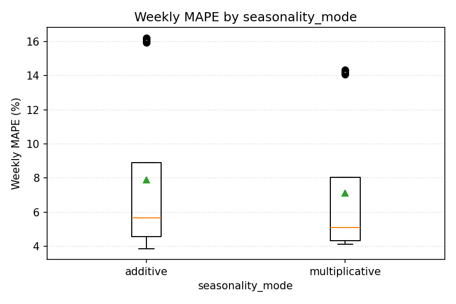
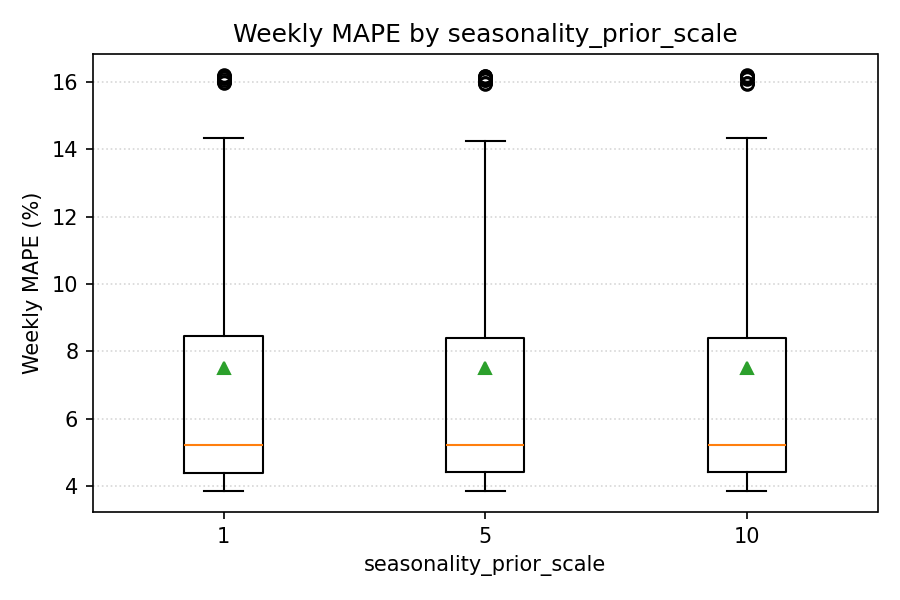
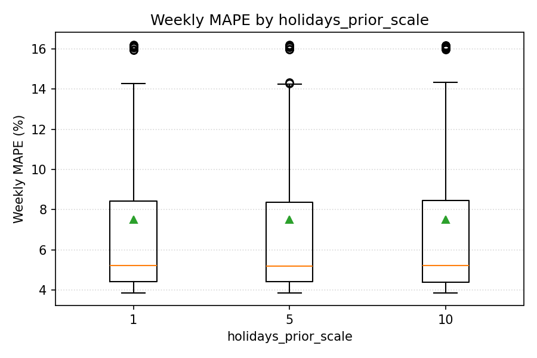
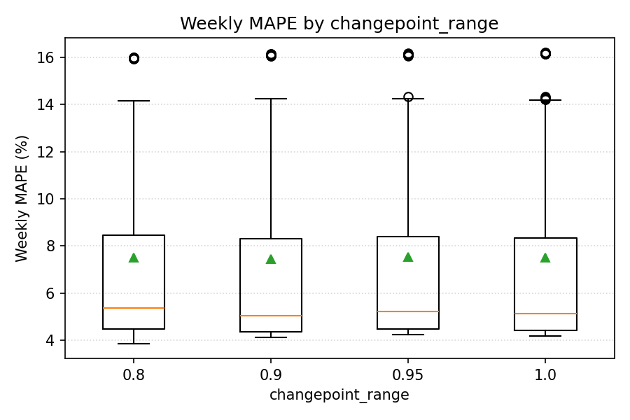
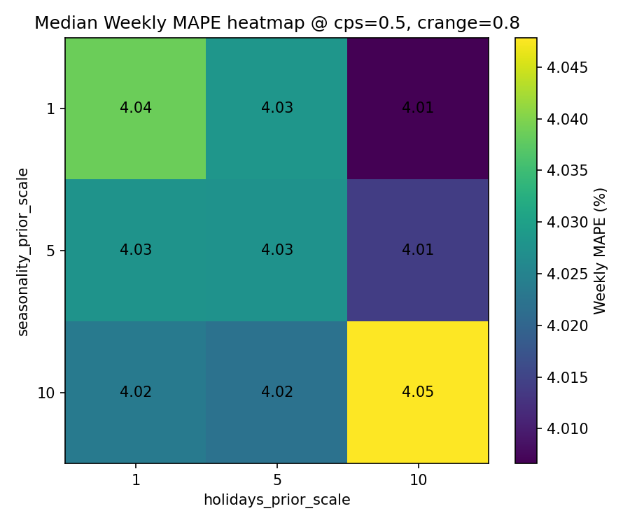

# TSA Passenger Volume Forecasting + Dashboard

Forecast daily U.S. air-travel demand using TSA checkpoint passenger counts (public data), track how forecasts perform over time, and explore everything in an interactive Streamlit dashboard.

## What this project does
- **Ingests data:** pulls the latest daily passenger counts from the TSA “Passenger Volumes” page (`https://www.tsa.gov/travel/passenger-volumes`).
- **Trains a forecast model:** fits a Facebook/Meta Prophet time-series model with trend + seasonality + US holidays.
- **Generates outputs:** writes a 30‑day daily forecast (`data/tsa_forecast.csv`) with uncertainty intervals.
- **Tracks real-world accuracy:** logs each week’s forecast snapshot (captured on Mondays) to `data/weekly_forecast_history.csv` so you can compare predictions vs actuals later.
- **Dashboard:** visualizes daily/weekly forecasts vs actuals, error metrics (MAE/MAPE), and the current week’s forecast.
- **Table:** overlays model-implied probabilities for the current week’s Kalshi TSA markets.

## Repo tour
- `scripts/update_data.py` — scrape + append newest TSA rows into `data/tsa_daily_full.csv`
- `scripts/retrain_model.py` — train Prophet, save `data/tsa_forecast.csv`, and (on Mondays) append to `data/weekly_forecast_history.csv`
- `scripts/tune_prophet.py` — rolling cross-validation grid search for next-week accuracy
- `scripts/plot_tuning_summary.py` — turn `tuning_results.csv` into charts in `reports/`
- `dashboard/app.py` — Streamlit dashboard (Plotly charts + optional Kalshi overlay)

## Run it
**Dashboard only**
1. `pip install -r requirements.txt`
2. `streamlit run dashboard/app.py`

**Training / updating data**
1. `pip install -r requirements-train.txt`
2. `python scripts/update_data.py`
3. `python scripts/retrain_model.py`

## Improvements
**Next-week MAPE improved from 6.52% → 3.84%** (**41.1%** relative improvement) by tuning Prophet’s trend/seasonality/holiday priors using rolling cross-validation.

**Best tuned config**
- `changepoint_prior_scale`: **0.5**
- `seasonality_mode`: **additive**
- `seasonality_prior_scale`: **1**
- `holidays_prior_scale`: **10**
- `changepoint_range`: **0.8**

More tuning comparisons

